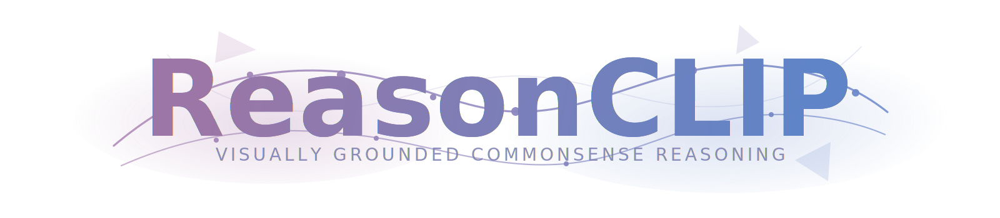

<div align="center">
  

  📄 **[Paper](https://img.shields.io/badge/Paper-TODO-gray)** | 
  🤗 **[Models](https://huggingface.co/collections/RISys-Lab/reasonclip-models)** | 
  🤗 **[Dataset](https://huggingface.co/collections/RISys-Lab/reasonclip-data)** | 
  🤗 **[BenchMark](https://huggingface.co/RISys-Lab/RCLIP-Bench)** | 
  📊 **[Model Card](doc/model_card.md)**
</div>


## News

- `[TODO date]` Release ReasonCLIP Datasets, Benchmark and Models.
- `[TODO date]` Release LLaVA-NeXT Model integrated with ReasonCLIP.

<!-- <details>
<summary>More</summary>

- `[TODO older date]` Older update 1.
- `[TODO older date]` Older update 2.

</details> -->

---
## 📖 Table of Contents
TL,DR: ✅ marks the most important parts, scroll down to find them.
- [Introduction](#-introduction)
- [Quick Start](#-quick-start)
- [Training](#-training)
- [Evaluation](#-evaluation)
- [Citation & License](#-citation--license)
<!-- - [Integration](#integration) -->


---
## 🔍 Introduction

ReasonCLIP is a CLIP-style training framework for improving visual representation learning with reasoning-aware supervision. This repository currently contains staged training recipes, evaluation pipelines, and integration examples for downstream multimodal experiments.

## ⚡ Quick Start
### Quick Inference ✅

ReasonCLIP **does not modify any model architecture**. For inference/loading, please use the **official Hugging Face `transformers` code path**. You only need to replace the model ID with a ReasonCLIP checkpoint.

- Inference with ReasonCLIP or ReasonSigLIP
```python
from PIL import Image
import requests
from transformers import AutoModel, AutoProcessor

model_id = "fesvhtr/RC-B32-S1"
model = AutoModel.from_pretrained(model_id)
processor = AutoProcessor.from_pretrained(model_id)

url = "http://images.cocodataset.org/val2017/000000039769.jpg"
image = Image.open(requests.get(url, stream=True).raw)

inputs = processor(text=["a photo of a cat", "a photo of a dog"], images=image, return_tensors="pt", padding=True)

outputs = model(**inputs)
logits_per_image = outputs.logits_per_image
probs = logits_per_image.softmax(dim=1)
```

### Quick Evaluation

Evaluate one checkpoint with the standard benchmark suite:

```bash
bash scripts/eval_single.sh fesvhtr/RC-B32-S1
```

To reproduce the full released-model table, run the full sweep:

```bash
bash scripts/eval_all.sh
```

---

## 🚀 Training
### Environment Preparation
> [!NOTE]
> We do not distribute CC12M images. To reproduce training, download the images from [`pixparse/cc12m-wds`](https://huggingface.co/datasets/pixparse/cc12m-wds) separately.

### Stage 1
<details>
<summary>Click to expand data download code</summary>

```python
from huggingface_hub import snapshot_download

snapshot_download(
    repo_id="RISys-Lab/CLIPReasonLite-42M",
    repo_type="dataset",
    local_dir="path/to/s1",
    allow_patterns="*.parquet",
)
```

</details>

```bash
bash scripts/train_s1.sh
```

### Stage 2
<details>
<summary>Click to expand data download code</summary>

```python
from huggingface_hub import snapshot_download

snapshot_download(
    repo_id="RISys-Lab/CLIPReasonPro-16M",
    repo_type="dataset",
    local_dir="path/to/s2",
    allow_patterns="*.parquet",
)
```

</details>

```bash
bash scripts/train_s2.sh
```

### Direct Training (S0-Rea & S0-Des)
<details>
<summary>Click to expand data download code</summary>

```python
from huggingface_hub import snapshot_download

snapshot_download(
    repo_id="RISys-Lab/CC12M-Refined",
    repo_type="dataset",
    local_dir="path/to/s0-des",
    allow_patterns="*.parquet",
)
```

</details>
Descriptive supervision:

```bash
bash scripts/train_des_direct.sh
```
<details>
<summary>Click to expand data download code</summary>

```python
from huggingface_hub import snapshot_download

snapshot_download(
    repo_id="RISys-Lab/CLIPReasonLite-42M",
    repo_type="dataset",
    local_dir="path/to/s0-rea/s1",
    allow_patterns="*.parquet",
)
snapshot_download(
    repo_id="RISys-Lab/CLIPReasonPro-16M",
    repo_type="dataset",
    local_dir="path/to/s0-rea/s2",
    allow_patterns="*.parquet",
)
```

</details>
Reasoning supervision:

```bash
bash scripts/train_rea_direct.sh
```

---

## 📊 Evaluation

### Evaluate a Single Model

```bash
bash scripts/eval_single.sh fesvhtr/RC-B32-S1
```

Replace the argument with any checkpoint from the model table. Released checkpoints include their processor files, so no processor argument is required. To override the processor manually, pass it as the second argument.
Urban1k retrieval is loaded directly from `fesvhtr/Urban1k` on Hugging Face.

This runs the standard evaluation suite for one checkpoint:

- ImageNet zero-shot classification
- Urban1k retrieval
- MSCOCO retrieval
- Flickr30k retrieval
- WinoGAViL
- compositional evaluation
- SugarCrepe++

### Full ReasonCLIP Evaluation Sweep

```bash
bash scripts/eval_all.sh
```

This script evaluates every released ReasonCLIP checkpoint listed in `model/models_final.sh`. `eval_all.sh` calls `scripts/eval_single.sh` once for each model. If a model list defines an optional `processors` array, those processor paths are used as overrides.

Use this only when reproducing the full table or benchmarking all released models. For normal use, evaluate a single checkpoint with `scripts/eval_single.sh`.

The full sweep covers the same benchmarks:

- ImageNet zero-shot classification
- Urban1k retrieval
- MSCOCO retrieval
- Flickr30k retrieval
- WinoGAViL
- compositional evaluation
- SugarCrepe++

### RCLIP Evaluation ✅

```bash
bash scripts/eval_RCLIP.sh
```

RCLIP-Bench is loaded directly from `RISys-Lab/RCLIP-Bench` on Hugging Face by default. The Python entrypoints still accept a local JSONL path via `--data` for compatibility.

This script covers:

- RCLIP commonsense reasoning evaluation
- RCLIP retrieval evaluation

### Individual Evaluation Entrypoints

```bash
python eval/eval_zeroshot_imagenet.py --help
python eval/eval_retrieval.py --help
python eval/eval_winogavil.py --help
python eval/eval_sugarcrepe_pp.py --help
python eval/eval_RCLIP.py --help
```


---

<!-- ## Integration

The repository also includes a `llava_next/` directory for downstream multimodal work. -->

All evaluations were conducted using [lmms_eval](https://github.com/EvolvingLMMs-Lab/lmms-eval).

---

## 📝 Citation & License
<a rel="license" href="http://creativecommons.org/licenses/by-nc-sa/4.0/"></a><br />This work is licensed under a <a rel="license" href="http://creativecommons.org/licenses/by-nc-sa/4.0/">Creative Commons Attribution-NonCommercial-ShareAlike 4.0 International License</a>.
Please cite this paper by:
```
TBD
```
