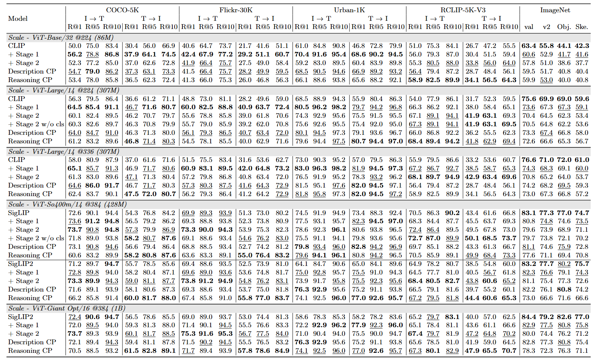
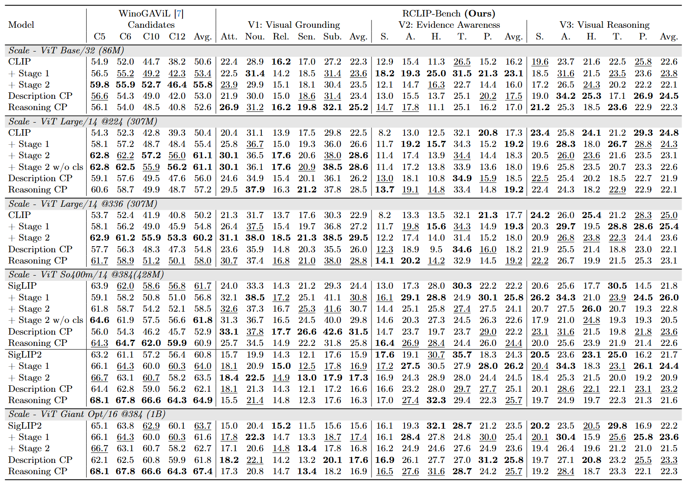
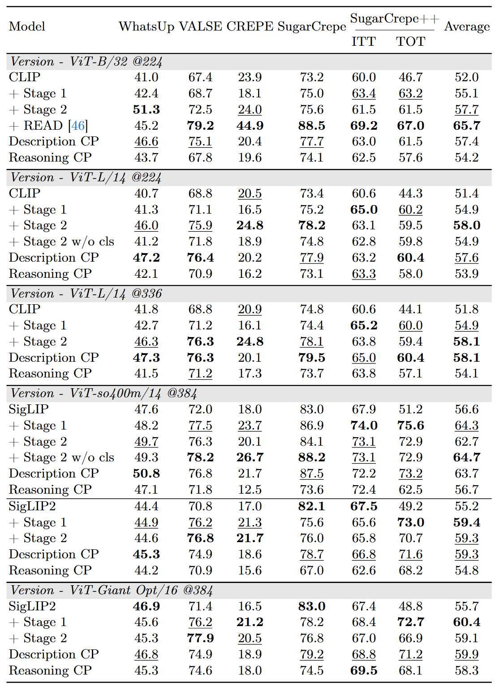

## Model Card
This page provides checkpoint links for all released models. Models marked with ✅ are recommended as the first choice. If they do not fit your setting, models marked with 📖 are the alternative recommended checkpoints.

| Training Stage | data | Base on | Note | 
| --- | --- | --- | --- |
| Stage 0 - Reasoning | ReasonCLIP-58M | Original model | Directly trained with large-scale reasoning data. |
| Stage 0 - Descriptive | CC12M-Refined | Original model | Directly trained with large-scale detailed description data. |
| Stage 1 | ReasonLite-42M | Original model | Dual-stream training with both reasoning and descriptive data. |
| Stage 2 | ReasonPro-16M | Stage 1 checkpoint | Further reasoning specialization on top of Stage 1 with category supervision. |
| [READ Training](https://github.com/JiH00nKw0n/READ-CLIP) | COCO | Stage 1 checkpoint | Current state-of-the-art method for compositional reasoning. |

### ReasonCLIP Series
| model | stage | scale | link | Recommended Tasks |
| --- | --- | --- | --- | --- |
| CLIP | base | ViT-B/32 | [🤗 HF / OpenAI](https://huggingface.co/openai/clip-vit-base-patch32) | - |
| ReasonCLIP | Stage 1 | ViT-B/32 | [🤗 HF / ReasonCLIP-B32-S1](https://huggingface.co/RISys-Lab/ReasonCLIP-B32-S1) | ✅ For Comprehensive Tasks |
| ReasonCLIP | Stage 2 | ViT-B/32 | [🤗 HF / ReasonCLIP-B32-S2](https://huggingface.co/RISys-Lab/ReasonCLIP-B32-S2) | - |
| ReasonCLIP | [READ Training](https://github.com/JiH00nKw0n/READ-CLIP) | ViT-B/32 | [🤗 HF / ReasonCLIP-B32-READ](https://huggingface.co/RISys-Lab/ReasonCLIP-B32-READ) | 📖 For Compostitional Reasoning Tasks |
| ReasonCLIP | Stage 0 - Reasoning | ViT-B/32 | [🤗 HF / ReasonCLIP-B32-S0-Rea](https://huggingface.co/RISys-Lab/ReasonCLIP-B32-S0-Rea) | - |
| ReasonCLIP | Stage 0 - Descriptive | ViT-B/32 | [🤗 HF / ReasonCLIP-B32-S0-Des](https://huggingface.co/RISys-Lab/ReasonCLIP-B32-S0-Des) | - |
| CLIP | base | ViT-L/14-224| [🤗 HF / OpenAI](https://huggingface.co/openai/clip-vit-large-patch14) | - |
| ReasonCLIP | Stage 1 | ViT-L/14-224 | [🤗 HF / ReasonCLIP-L14-224-S1](https://huggingface.co/RISys-Lab/ReasonCLIP-L14-224-S1) | ✅ For Comprehensive Tasks  |
| ReasonCLIP | Stage 2 | ViT-L/14-224 | [🤗 HF / ReasonCLIP-L14-224-S2](https://huggingface.co/RISys-Lab/ReasonCLIP-L14-224-S2) | - |
| ReasonCLIP | Stage 0 - Reasoning | ViT-L/14-224 | [🤗 HF / ReasonCLIP-L14-224-S0-Rea](https://huggingface.co/RISys-Lab/ReasonCLIP-L14-224-S0-Rea) | - |
| ReasonCLIP | Stage 0 - Descriptive | ViT-L/14-224 | [🤗 HF / ReasonCLIP-L14-224-S0-Des](https://huggingface.co/RISys-Lab/ReasonCLIP-L14-224-S0-Des) | - |
| CLIP | base | ViT-L/14-336| [🤗 HF / OpenAI](https://huggingface.co/openai/clip-vit-large-patch14-336) | - |
| ReasonCLIP | Stage 1 | ViT-L/14-336 | [🤗 HF / ReasonCLIP-L14-336-S1](https://huggingface.co/RISys-Lab/ReasonCLIP-L14-336-S1) | ✅ For Comprehensive Tasks  |
| ReasonCLIP | Stage 2 | ViT-L/14-336 | [🤗 HF / ReasonCLIP-L14-336-S2](https://huggingface.co/RISys-Lab/ReasonCLIP-L14-336-S2) | - |
| ReasonCLIP | Stage 0 - Reasoning | ViT-L/14-336 | [🤗 HF / ReasonCLIP-L14-336-S0-Rea](https://huggingface.co/RISys-Lab/ReasonCLIP-L14-336-S0-Rea) | - |
| ReasonCLIP | Stage 0 - Descriptive | ViT-L/14-336 | [🤗 HF / ReasonCLIP-L14-336-S0-Des](https://huggingface.co/RISys-Lab/ReasonCLIP-L14-336-S0-Des) | - |

### ReasonSigLIP Series
| model | stage | scale | link | Recommended Tasks |
| --- | --- | --- | --- | --- |
| SigLIP | base | ViT-So400M/14 | [🤗 HF / Google](https://huggingface.co/google/siglip-so400m-patch14-384)| - |
| ReasonSigLIP | Stage 1 | ViT-So400M/14 | [🤗 HF / ReasonSigLIP-So14-384-S1](https://huggingface.co/RISys-Lab/ReasonSigLIP-So14-384-S1) | 📖 For Compostitional Reasoning Tasks |
| ReasonSigLIP | Stage 2 | ViT-So400M/14 | [🤗 HF / ReasonSigLIP-So14-384-S2](https://huggingface.co/RISys-Lab/ReasonSigLIP-So14-384-S2)| ✅ For Comprehensive Tasks |
| ReasonSigLIP | Stage 0 - Reasoning | ViT-So400M/14 | [🤗 HF / ReasonSigLIP-So14-384-S0-Rea](https://huggingface.co/RISys-Lab/ReasonSigLIP-So14-384-S0-Rea)| - |
| ReasonSigLIP | Stage 0 - Descriptive | ViT-So400M/14 | [🤗 HF / ReasonSigLIP-So14-384-S0-Des](https://huggingface.co/RISys-Lab/ReasonSigLIP-So14-384-S0-Des) | - |
| SigLIP2 | base | ViT-So400M/14 | [🤗 HF / Google](https://huggingface.co/google/siglip2-so400m-patch14-384) | - |
| ReasonSigLIP2 | Stage 1 | ViT-So400M/14 | [🤗 HF / ReasonSigLIP2-So14-384-S1](https://huggingface.co/RISys-Lab/ReasonSigLIP2-So14-384-S1) | 📖 For Compostitional Reasoning Tasks|
| ReasonSigLIP2 | Stage 2 | ViT-So400M/14 | [🤗 HF / ReasonSigLIP2-So14-384-S2](https://huggingface.co/RISys-Lab/ReasonSigLIP2-So14-384-S2) | ✅ For Comprehensive Tasks |
| ReasonSigLIP2 | Stage 0 - Reasoning | ViT-So400M/14 | [🤗 HF / ReasonSigLIP2-So14-384-S0-Rea](https://huggingface.co/RISys-Lab/ReasonSigLIP2-So14-384-S0-Rea) | - |
| ReasonSigLIP2 | Stage 0 - Descriptive | ViT-So400M/14 | [🤗 HF / ReasonSigLIP2-So14-384-S0-Des](https://huggingface.co/RISys-Lab/ReasonSigLIP2-So14-384-S0-Des) | - |
| SigLIP2 | base | ViT-Giant-Opt/16 | [🤗 HF / Google](https://huggingface.co/google/siglip2-giant-opt-patch16-384) | - |
| ReasonSigLIP2 | Stage 1 | ViT-Giant-Opt/16 | [🤗 HF / ReasonSigLIP2-go16-384-S1](https://huggingface.co/RISys-Lab/ReasonSigLIP2-go16-384-S1) | 📖 For Compostitional Reasoning Tasks|
| ReasonSigLIP2 | Stage 2 | ViT-Giant-Opt/16 | [🤗 HF / ReasonSigLIP2-go16-384-S2](https://huggingface.co/RISys-Lab/ReasonSigLIP2-go16-384-S2) | ✅ For Comprehensive Tasks |
| ReasonSigLIP2 | Stage 0 - Reasoning | ViT-Giant-Opt/16 | [🤗 HF / ReasonSigLIP2-go16-384-S0-Rea](https://huggingface.co/RISys-Lab/ReasonSigLIP2-go16-384-S0-Rea) | - |
| ReasonSigLIP2 | Stage 0 - Descriptive | ViT-Giant-Opt/16 | [🤗 HF / ReasonSigLIP2-go16-384-S0-Des](https://huggingface.co/RISys-Lab/ReasonSigLIP2-go16-384-S0-Des) | - |

### Detailed Results
#### Zero-shot retrieval and Zero-shot classification

#### VisuComprehensivey Grounded Commonsense Reasoning

#### Compositional reasoning

